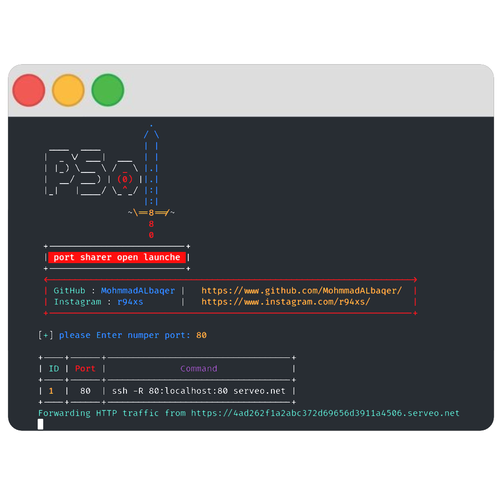

### Installation (Linux)

```
$ git clone https://github.com/MohmmadALbaqer/psol.git
$ cd psol
$ pip3 install -r requirements.txt
$ sudo bash install.sh
$ python3 psol.py

```

### SCREEN SHOT





## [~] Find Me on :

- [](https://github.com/MohmmadALbaqer)


- [](https://instagram.com/r94xs)

