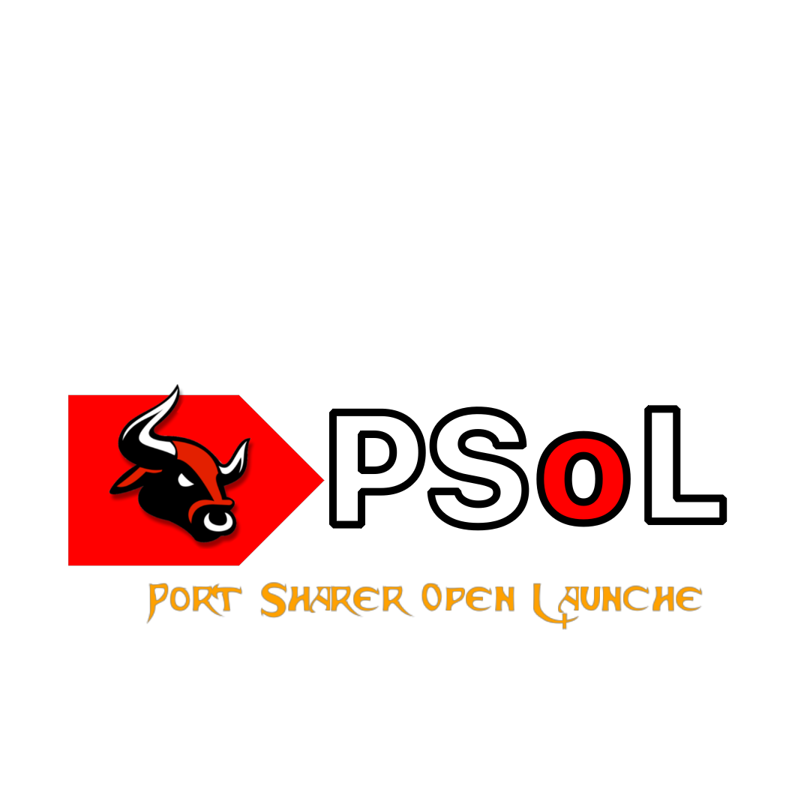
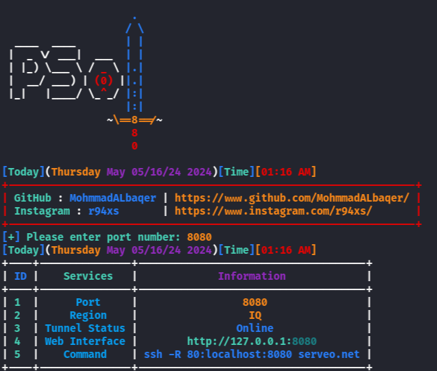

### What is it PSOL?

```
It is a tool similar to the Ngrok tool, the same process and work
it was designed specifically because of the ban problems in Ngrok
but this is the best and easiest way to solve problems.
```

### Installation (Linux)

```
$ git clone https://github.com/MohmmadALbaqer/psol.git
$ cd psol
$ pip3 install -r requirements.txt
$ chmod +x *
$ sudo bash install.sh #Linux
$ bash install-termux.sh #termux
$ python3 psol.py

```

### Systems that support PSOL?

```
- Windows
- Linux
- MacBook
- TERMUX
```

### SCREEN SHOT




## [~] Find Me on :

- [](https://github.com/MohmmadALbaqer)


- [](https://instagram.com/r94xs)

